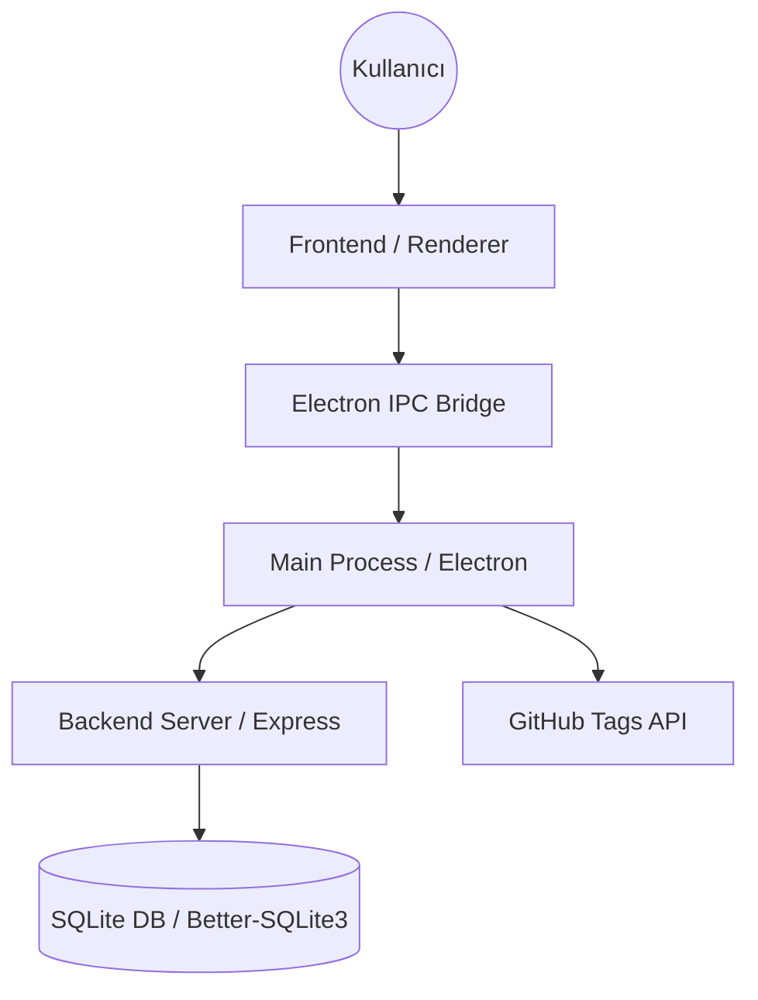

# ValeBook Mimari Dokümantasyonu (v1.1.54)

## Sistem Genel Bakış
ValeBook, otopark ve vale işletmeleri için geliştirilmiş, yerel veritabanı (SQLite) kullanan bir Electron uygulamasıdır.

## Teknoloji Yığını
- **Frontend**: HTML5, Vanilla CSS, JavaScript (ES6+), Chart.js
- **Backend**: Node.js, Express.js
- **Veritabanı**: Better-SQLite3
- **Masaüstü Katmanı**: Electron.js
- **Güncelleme**: GitHub Tags API + Electron-Updater

## Temel Bileşenler ve Akış

## Veritabanı Şeması
- `income`: Gelir kayıtları (Nakit, POS, Abonelik)
- `expense`: Gider kayıtları ve kategorileri
- `pos_machines`: POS cihaz tanımları ve komisyon oranları
- `settings`: İşletme genel ayarları

## Güncelleme Mekanizması (v1.1.42+)
Sistem "Stateful" bir güncelleme takibi yapar:
1. Uygulama açılışında GitHub Tags API taranır.
2. Mevcut sürümden yeni bir etiket varsa, `Main Process` durumu hafızaya alır.
3. Kullanıcı Ayarlar sayfasını açtığında, UI bu durumu "Pull" ederek (çekerek) kullanıcıya anlık bilgi sunar.
4. Güncelleme varsa, kullanıcı doğrudan GitHub Release sayfasına yönlendirilir.

v1.1.54
